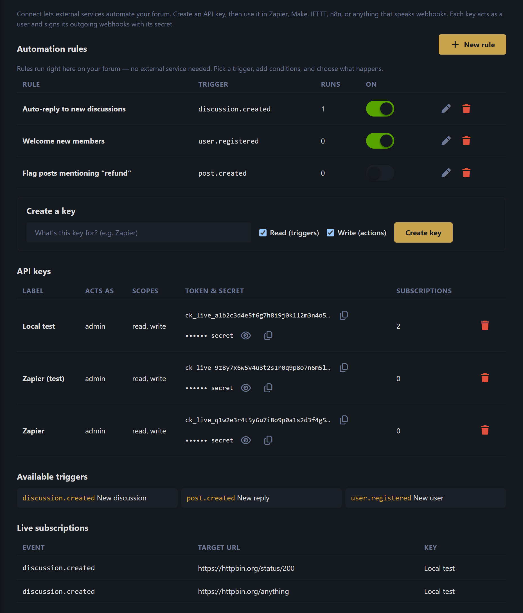
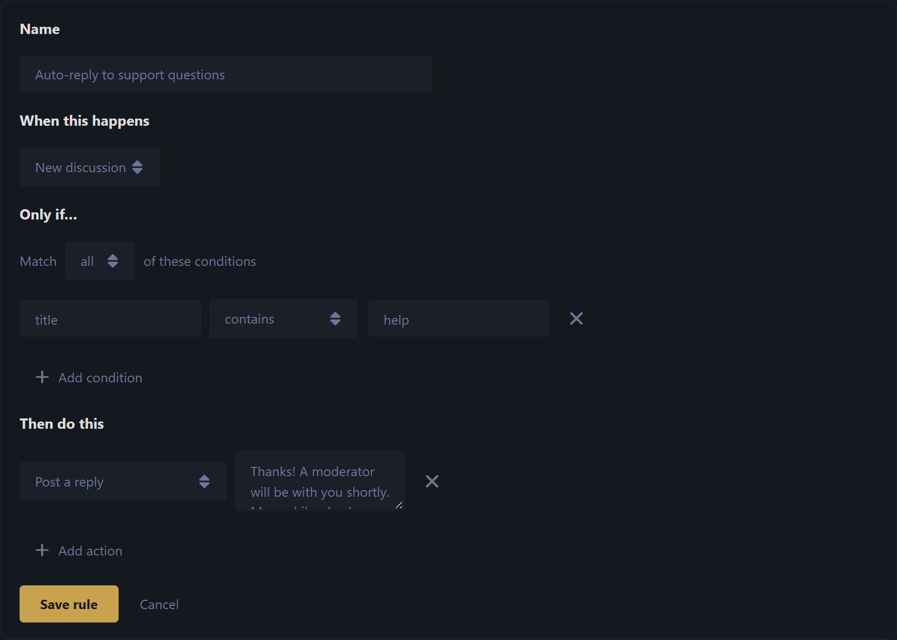

# Connect for Flarum 2

> **Automation for your forum.** Connect gives Flarum 2 outgoing webhooks, a
> scoped REST API, and an in-app *if-this-then-that* Rules engine. Wire your
> community up to **Zapier, Make, IFTTT, n8n** — or automate things right on the
> forum with no external service at all.
>
> Free and **MIT-licensed**.

[](https://flarum.org)
[](LICENSE)
[](https://php.net)

---

## What it does

Connect covers both directions of automation:

- **Out of your forum → anywhere.** When a discussion is started, a reply is
  posted, or a user registers, Connect fires a signed webhook to whatever URL
  you (or a Zap) subscribed. Perfect for Zapier/Make/IFTTT/n8n triggers.
- **Anywhere → into your forum.** A scoped API key lets an external service
  create discussions and replies *as a real user*, through Flarum's own API — so
  every permission and validation rule still applies.
- **Inside your forum.** The built-in **Rules** engine runs trigger → conditions
  → actions entirely on your server. No third-party account, no per-task billing,
  no data leaving the box.



---

## Automation rules (no external service needed)

Pick a **trigger**, add optional **conditions**, and choose one or more
**actions**. Rules run on a queue, off the request path, so they never slow down
the person who triggered them.



**Triggers**

| Event | Fires when |
| --- | --- |
| `discussion.created` | someone starts a new discussion |
| `post.created` | someone posts a reply |
| `user.registered` | a new member signs up |

**Conditions** — match **all** or **any** of a list. Each condition compares a
payload field (e.g. `title`, `content`, `tagList`) using one of:
`is`, `is not`, `contains`, `does not contain`, `starts with`, `is greater than`,
`is less than`, `is empty`, `is not empty`, `matches (regex)`.

**Actions**

| Action | What it does |
| --- | --- |
| Post a reply | replies to the discussion the event is about |
| Add / remove a tag | requires [flarum/tags] |
| Add / remove from a group | changes the involved user's groups |
| Call a webhook | POSTs the event payload to a URL you choose |

> Actions are isolated — if one fails, the rest of the rule still runs — and each
> rule tracks how many times it has run.

---

## Connecting Zapier / Make / IFTTT / n8n

1. In **Admin → Connect**, create an API key. Give it a label (e.g. *Zapier*) and
   the scopes it needs — **Read** for triggers, **Write** for actions.
2. Copy the **token** (`ck_…`) and **secret** (`cs_…`).
3. In your automation tool, add a webhook that authenticates with
   `Authorization: Bearer ck_…`.
   - To **receive** forum events, subscribe your tool's catch-hook URL (Zapier
     does this automatically via REST Hooks — see the API below).
   - To **act** on the forum, POST to the action endpoints.

Every outgoing delivery is **HMAC-signed** so you can verify it really came from
your forum:

```
X-Connect-Signature: sha256=<hex>

valid  ⇔  signature == 'sha256=' + hmac_sha256(rawRequestBody, keySecret)
```

---

## REST API

All routes are under your forum's API root (`/api`). Authenticate with
`Authorization: Bearer ck_…`.

| Method | Endpoint | Purpose |
| --- | --- | --- |
| `GET` | `/connect/me` | Who this key acts as (auth test) |
| `POST` | `/connect/hooks` | Subscribe: `{ event, targetUrl }` → REST Hook, returns `{ id }` |
| `DELETE` | `/connect/hooks/{id}` | Unsubscribe |
| `GET` | `/connect/samples/{event}` | Recent real items shaped like the payload (Zap setup) |
| `POST` | `/connect/actions/discussions` | Create a discussion `{ title, content }` |
| `POST` | `/connect/actions/posts` | Reply to a discussion `{ discussionId, content }` |

A `410 Gone` from a subscribed target auto-prunes the subscription — so a Zap you
turn off cleans itself up.

### Example

```bash
# What does this key act as?
curl https://your-forum.example/api/connect/me \
  -H "Authorization: Bearer ck_live_xxx"

# Create a discussion as the key's user
curl -X POST https://your-forum.example/api/connect/actions/discussions \
  -H "Authorization: Bearer ck_live_xxx" \
  -H "Content-Type: application/json" \
  -d '{"title":"Posted from Zapier","content":"Hello from an automation!"}'
```

---

## Installation

```bash
composer require ernestdefoe/connect
```

Then enable **Connect** in **Admin → Extensions**. Make sure a queue worker is
running (`php flarum queue:work`) so webhooks and rule actions are delivered.

The tag actions light up automatically if [flarum/tags] is installed; everything
else works on a stock forum.

## Minting a key from the CLI

```bash
php flarum connect:key "My key" --scopes=read,write
```

---

## Requirements

- Flarum `^2.0`
- PHP `^8.3`
- A running queue worker (recommended — webhooks and rule actions are queued)

## License

[MIT](LICENSE) © Ernest Defoe

[flarum/tags]: https://github.com/flarum/tags
